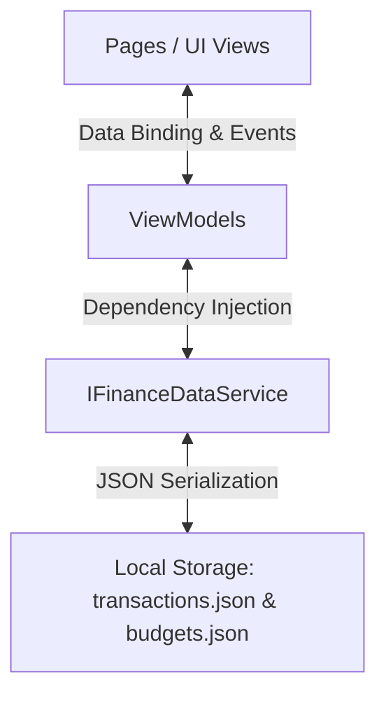

# ⌁ Finance Tracker Onboarding Guide

Welcome to the **Finance Tracker** codebase! This onboarding guide is designed to give you a complete walkthrough of the codebase, explain its distinct design system, outline core functionalities, and guide you through setting up your development environment on Windows to start contributing.

---

## 1. Visual Paradigm & Core Concept

Unlike standard mobile apps with soft pastel cards, rounded boxes, and 3D graphics, this Finance Tracker implements a **strict, flat, terminal-inspired (CLI) visual language**. 

### Core Design Rules
* **Monospace Typography**: The application enforces system monospace fonts (`Consolas` on Windows, `monospace` on Android, `Menlo` on iOS/macOS) for all text to achieve a raw terminal style.
* **Flat Layout**: No cards, drop shadows, or standard modern visual hierarchies are used. Solid blocks, ASCII borders, and direct grids dictate layout.
* **Palette**: Tailored dark mode using:
  - Deep Navy background (`#0A0E17`)
  - Warm Amber for highlights and warnings (`#F5A623`)
  - Cyan / Soft Blue for positive amounts and normal actions (`#56B6C2`)
  - Coral / Soft Red for negative numbers and errors (`#E06C75`)
  - Sleek Gray for comments and muted text (`#6C7A89`)
* **ASCII Artwork & Visualization**: Charts and progress indicators are rendered inline using block-drawing characters (`█`, `░`) and custom ASCII lines instead of canvas/SVG chart libraries.

---

## 2. Codebase Directory Map

```
maui-finance-tracker/
│
├── App.xaml / App.xaml.cs          # Global application resources, dark mode setup, service initialization
├── AppShell.xaml / AppShell.cs     # Main app navigation structure and tab routing
├── MauiProgram.cs                  # Dependency Injection (DI) registry & bootstrap entry point
├── FinanceTracker.csproj           # MSBuild project file (defines targets for Windows/Android/iOS)
│
├── Models/                         # Plain Old C# Objects (POCOs) for records and enums
│   ├── FinanceEntryType.cs         # Enum mapping (Expense = 0, Income = 1)
│   ├── FinanceRecord.cs            # Sealed record representing a ledger transaction
│   └── BudgetAllocation.cs         # Sealed record representing a budget limit for a category and month
│
├── Services/                       # Shared platform logic and state management
│   ├── IFinanceDataService.cs      # Contract for data access operations
│   └── FinanceDataService.cs       # JSON file-backed local persistence engine using SemaphoreSlim
│
├── ViewModels/                     # Page state machines using CommunityToolkit.Mvvm
│   ├── OverviewViewModel.cs        # Builds ASCII charts, daily calendars, and summary stats
│   ├── AddExpenseViewModel.cs      # Core entry logic, validation, and category mappings
│   ├── BudgetViewModel.cs          # Interactive budgeting, unallocated funds logic, and ASCII bars
│   └── HistoryViewModel.cs         # Groups ledger logs chronologically by month
│
├── Pages/                          # XAML Layouts and View code-behinds
│   ├── OverviewPage.xaml/.cs       # Dashboard grid (also duplicated as MainPage.xaml in root)
│   ├── AddExpensePage.xaml/.cs     # Terminal-themed entry form
│   ├── BudgetPage.xaml/.cs         # Allocations and interactive set/edit prompt modals
│   └── HistoryPage.xaml/.cs        # Month-grouped transaction list with inline quick actions
│
└── Helpers/                        # Pure mathematical and formatting utility classes
    ├── FinanceMath.cs              # Safe summation, signed currency formats, and net calculations
    └── FinanceCatalog.cs           # Category lists, custom emoji maps, and helper methods
```

---

## 3. Architecture & Data Flow

This application is built on a decoupled **MVVM (Model-View-ViewModel)** architecture:



### 3.1 Data Persistence (`Services/`)
The application uses local JSON files in the platform's application data directory, making it fully self-contained and privacy-first.
* **Thread-Safety**: Access is synchronized using a `SemaphoreSlim gate = new(1, 1)` to prevent race conditions during concurrent read/writes.
* **Files**:
  - `transactions.json`: Stored as a list inside a `FinanceSnapshot`.
  - `budgets.json`: Stored as a list inside a `BudgetSnapshot`.
* **Change Notification**: Provides events `TransactionsChanged` and `BudgetsChanged` to propagate real-time reactive updates to active ViewModels when data is added, updated, or removed.

### 3.2 View-State Engines (`ViewModels/`)
* **`OverviewViewModel`**: 
  - Generates the custom month calendar grid with day selectors.
  - Builds dynamic **ASCII charts** for 7-day spending trends (`#` bars), category breakdowns, monthly cash-flow comparison, and transaction clearance statuses.
* **`AddExpenseViewModel`**:
  - Automatically loads appropriate subcategories based on the chosen transaction type (Income vs Expense).
  - Handles parsing and validation of currency, formatting clean status messages (e.g. `ready for a new log entry` -> `entry saved locally`).
* **`BudgetViewModel`**:
  - Scopes budgets strictly **per calendar month**.
  - Tracks the "Unallocated Pool" (Total Income in month minus assigned limits) to prevent overallocation.
  - Renders inline ASCII progress bars `[████░░░░░░] 40%` using standard string repetition.
* **`HistoryViewModel`**:
  - Chronologically groups records using `.GroupBy(...)` by month-start date.
  - Provides commands to perform in-place updates or deletions.

---

## 4. Setting Up Your Environment on Windows

Since standard CLI `dotnet` commands are not currently registered in your system PATH, follow these steps to build a high-productivity .NET MAUI development environment.

### Step 1: Install Visual Studio 2022 (Recommended)
Visual Studio 2022 provides the easiest automated workload management for .NET MAUI.
1. Download **[Visual Studio 2022 Community](https://visualstudio.microsoft.com/vs/community/)** (Free).
2. During installation, in the **Workloads** tab, check **.NET Multi-platform App UI development**.
3. Under the **Installation details** pane on the right, make sure **.NET SDK 10.0** (or the target version) is checked.
4. Click **Install**. This will install the compilers, platform workloads (Windows App SDK, Android SDK, build tools), and package managers.

### Step 2: Configure System PATH for CLI Support
To use `dotnet` in PowerShell/terminal, ensure the executable is in your PATH environment variable:
1. Locate the .NET installation folder. The default path on 64-bit Windows is:
   `C:\Program Files\dotnet\`
2. Open the Windows Start Menu, search for **Edit the system environment variables**, and press Enter.
3. Click the **Environment Variables...** button at the bottom.
4. Under **System variables**, select the **Path** variable and click **Edit...**.
5. Click **New** and add: `C:\Program Files\dotnet\`
6. Click **OK** to close all dialogs.
7. Open a fresh PowerShell prompt and verify the installation by typing:
   ```powershell
   dotnet --version
   ```

### Step 3: Install .NET MAUI Workloads manually (Alternative/Verification)
If you prefer VS Code or command-line tools:
1. Open PowerShell as Administrator.
2. Run the command to install/update the MAUI workload target:
   ```powershell
   dotnet workload install maui
   ```

---

## 5. Building, Running, & Packaging

Once the environment setup is complete, you can build and launch the application directly from PowerShell inside the root folder:

### Building for Windows
```powershell
# Build in debug mode
dotnet build -f net10.0-windows10.0.19041.0

# Build release build
dotnet build -c Release -f net10.0-windows10.0.19041.0
```

### Running on Windows
If `dotnet run` hangs because it's attached to the GUI thread:
```powershell
# Launch the built executable directly
.\bin\Debug\net10.0-windows10.0.19041.0\win-x64\FinanceTracker.exe
```

### Building for Android
```powershell
# Build signed APK ready for side-loading
dotnet build -c Release -f net10.0-android
```
The resulting APK will be saved at:
`bin/Release/net10.0-android/publish/com.companyname.financetracker-Signed.apk`

---

## 6. Curated Resources for Learning

To gain a complete master-level understanding of this stack, check out the following official and community resources:

* **.NET MAUI Framework**:
  - **[Official .NET MAUI Documentation](https://learn.microsoft.com/en-us/dotnet/maui/)**: Excellent starting point to learn Shell Navigation, UI layouts, and Cross-Platform API support.
  - **[C# Markup vs XAML in MAUI](https://learn.microsoft.com/en-us/dotnet/maui/user-interface/xaml/)**: Deep dive into structure declaration and resources/styling.
* **MVVM Design Pattern**:
  - **[CommunityToolkit.Mvvm Documentation](https://learn.microsoft.com/en-us/dotnet/communitytoolkit/mvvm/)**: Essential reading for attributes like `[ObservableProperty]`, `[RelayCommand]`, and code generators.
* **Data & Serialization**:
  - **[System.Text.Json Documentation](https://learn.microsoft.com/en-us/dotnet/standard/serialization/system-text-json-how-to)**: Explains the high-performance serialization engines utilized in `FinanceDataService`.
